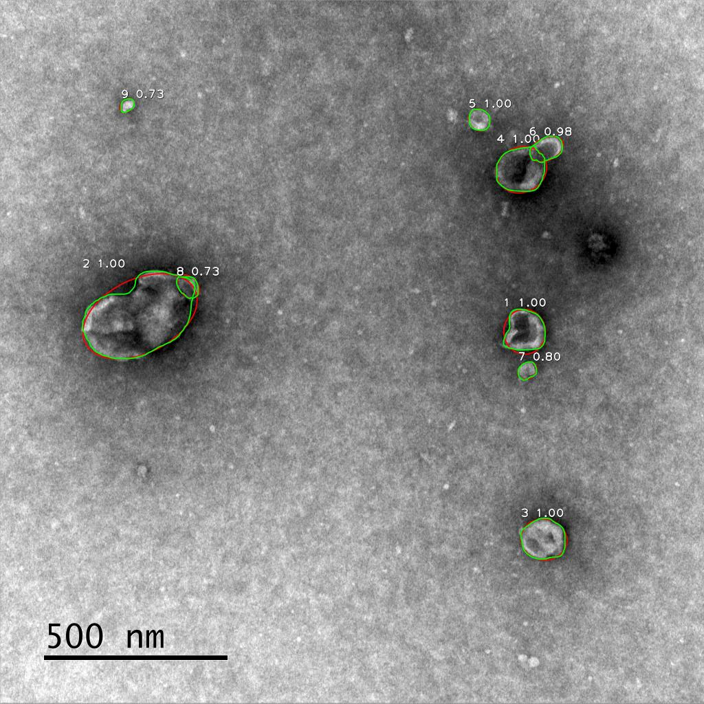

# Mask R-CNN Vesicle Segmentation
Mask R-CNN based extracellular vesicle instance segmentation

The repository includes:
* [detector.py](detector.py) Code for train and evaluation Mask R-CNN based on https://github.com/matterport/Mask_RCNN
* [server.py](server.py) Simple web interface based on Flask. You can see hosted application [here](https://www.bioeng.ru/exosomes/)
* [vesicle.py](vesicle.py) Command line tool for segmentation
* [Dataset](https://github.com/High-resolution-microscopy-laboratory/exosomes/releases/download/v1.0/dataset.zip)
* [Trained model](https://github.com/High-resolution-microscopy-laboratory/exosomes/releases/download/v1.0/mask_rcnn_vesicle.h5)

## Run web app in docker

First, download [model weights](https://github.com/High-resolution-microscopy-laboratory/exosomes/releases/download/v1.0/mask_rcnn_vesicle.h5).

1. For Windows, you can run the app using CPU (GPU version is not available). 
Run the following command from the python prompt (you should place the path to mask_rcnn_vesicle.h5 instead of ${MODEL_PATH}):  
'''
docker run -v ${MODEL_PATH}:/app/models/mask_rcnn_vesicle.h5 -p 8000:8000 highresolutionimaging/vesicles
'''

For example, if you have mask_rcnn_vesicle.h5 in C:\Users\User\Downloads, you should run
'''
docker run -v C:/Users/User/Downloads/mask_rcnn_vesicle.h5:/app/models/mask_rcnn_vesicle.h5 -p 8000:8000 highresolutionimaging/vesicles
'''

Then open localhost:8000 in the browser

2. For Linux, you can run the app using either CPU or GPU.
To use CPU, run the following command from the python prompt (you should place the path to mask_rcnn_vesicle.h5 instead of ${MODEL_PATH}):  
'''
docker run -v ${MODEL_PATH}:/app/models/mask_rcnn_vesicle.h5 -p 8000:8000 highresolutionimaging/vesicles
'''

To use GPU, install nvidia docker https://docs.nvidia.com/datacenter/cloud-native/container-toolkit/install-guide.html#installing-docker-ce
Then run the following (you should place the path to mask_rcnn_vesicle.h5 instead of ${MODEL_PATH}):  
'''
docker run -v ${MODEL_PATH}:/app/models/mask_rcnn_vesicle.h5 -p 8000:8000 --gpus all --env TF_FORCE_GPU_ALLOW_GROWTH=true highresolutionimaging/vesicles
'''

You can access the app on localhost:8000 

